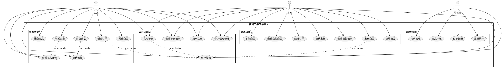
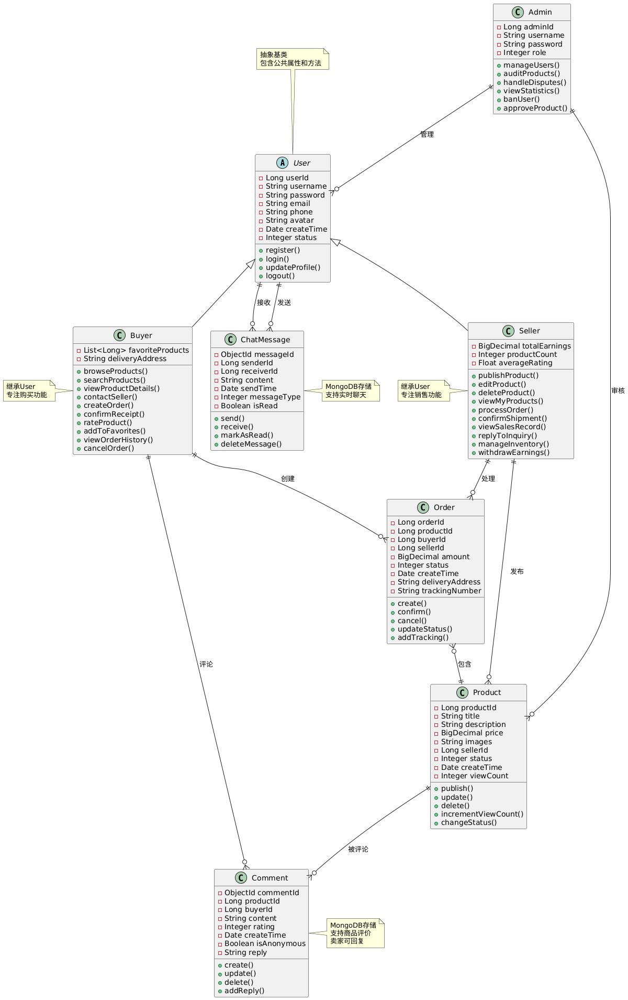

# 校园二手交易平台需求分析文档
## 需求分析
### 项目概述
基于多技术栈的校园二手交易平台，支持商品发布、交易、实时聊天等核心功能。
### 技术架构
- 后端 : Spring Boot (Java) - 主要业务逻辑
- 推荐系统 : Python - 商品推荐算法
- 实时通信 : Go - WebSocket聊天功能
- 前端 : Vue.js
- 数据库 : MySQL
### 核心功能模块
#### 用户模块
- 用户注册/登录
- 个人信息管理
- 密码重置
#### 商品模块
- 商品发布/编辑
- 商品浏览/搜索
- 商品分类管理
- 商品状态管理（上架/下架/已售）
#### 交易模块
- 订单创建
- 订单状态跟踪
- 交易确认
#### 聊天模块
- 实时消息
- 聊天记录
- 用户在线状态
#### 管理模块
- 用户管理
- 商品审核
- 数据统计
## 用例图

``` plantuml
@startuml
!define DIRECTION top to bottom direction

actor "买家" as Buyer
actor "卖家" as Seller  
actor "管理员" as Admin

rectangle "校园二手交易平台" {
  package "买家功能" {
    usecase "浏览商品" as UC3
    usecase "搜索商品" as UC4
    usecase "查看商品详情" as UC5
    usecase "联系卖家" as UC6
    usecase "创建订单" as UC7
    usecase "确认收货" as UC8
    usecase "评价商品" as UC9
  }
  
  package "卖家功能" {
    usecase "发布商品" as UC11
    usecase "编辑商品" as UC12
    usecase "下架商品" as UC13
    usecase "查看我的商品" as UC14
    usecase "处理订单" as UC15
    usecase "确认发货" as UC16
    usecase "查看销售记录" as UC17
  }
  
  package "公共功能" {
    usecase "用户注册" as UC1
    usecase "用户登录" as UC2
    usecase "个人信息管理" as UC10
    usecase "实时聊天" as UC18
    usecase "查看聊天记录" as UC19
  }
  
  package "管理功能" {
    usecase "用户管理" as UC20
    usecase "商品审核" as UC21
    usecase "订单管理" as UC22
    usecase "数据统计" as UC23
  }
}

' 买家用例连接
Buyer --> UC1
Buyer --> UC2
Buyer --> UC3
Buyer --> UC4
Buyer --> UC5
Buyer --> UC6
Buyer --> UC7
Buyer --> UC8
Buyer --> UC9
Buyer --> UC10
Buyer --> UC18
Buyer --> UC19

' 卖家用例连接
Seller --> UC1
Seller --> UC2
Seller --> UC11
Seller --> UC12
Seller --> UC13
Seller --> UC14
Seller --> UC15
Seller --> UC16
Seller --> UC17
Seller --> UC10
Seller --> UC18
Seller --> UC19

' 管理员用例连接
Admin --> UC2
Admin --> UC20
Admin --> UC21
Admin --> UC22
Admin --> UC23

' 依赖关系
UC11 ..> UC2 : <<include>>
UC7 ..> UC2 : <<include>>
UC18 ..> UC2 : <<include>>
UC6 ..> UC5 : <<extend>>
UC9 ..> UC8 : <<extend>>
@enduml
```




## 类图



``` python
@startuml
' MySQL存储的类
abstract class User {
  -Long userId
  -String username
  -String password
  -String email
  -String phone
  -String avatar
  -Date createTime
  -Integer status
  +register()
  +login()
  +updateProfile()
  +logout()
}

class Buyer extends User {
  -List<Long> favoriteProducts
  -String deliveryAddress
  +browseProducts()
  +searchProducts()
  +viewProductDetails()
  +contactSeller()
  +createOrder()
  +confirmReceipt()
  +rateProduct()
  +addToFavorites()
  +viewOrderHistory()
  +cancelOrder()
}

class Seller extends User {
  -BigDecimal totalEarnings
  -Integer productCount
  -Float averageRating
  +publishProduct()
  +editProduct()
  +deleteProduct()
  +viewMyProducts()
  +processOrder()
  +confirmShipment()
  +viewSalesRecord()
  +replyToInquiry()
  +manageInventory()
  +withdrawEarnings()
}

class Product {
  -Long productId
  -String title
  -String description
  -BigDecimal price
  -String images
  -Long sellerId
  -Integer status
  -Date createTime
  -Integer viewCount
  +publish()
  +update()
  +delete()
  +incrementViewCount()
  +changeStatus()
}

class Order {
  -Long orderId
  -Long productId
  -Long buyerId
  -Long sellerId
  -BigDecimal amount
  -Integer status
  -Date createTime
  -String deliveryAddress
  -String trackingNumber
  +create()
  +confirm()
  +cancel()
  +updateStatus()
  +addTracking()
}

class Admin {
  -Long adminId
  -String username
  -String password
  -Integer role
  +manageUsers()
  +auditProducts()
  +handleDisputes()
  +viewStatistics()
  +banUser()
  +approveProduct()
}

' MongoDB存储的类
class ChatMessage {
  -ObjectId messageId
  -Long senderId
  -Long receiverId
  -String content
  -Date sendTime
  -Integer messageType
  -Boolean isRead
  +send()
  +receive()
  +markAsRead()
  +deleteMessage()
}

class Comment {
  -ObjectId commentId
  -Long productId
  -Long buyerId
  -String content
  -Integer rating
  -Date createTime
  -Boolean isAnonymous
  -String reply
  +create()
  +update()
  +delete()
  +addReply()
}

' 关系定义
Seller ||--o{ Product : "发布"
Buyer ||--o{ Order : "创建"
Seller ||--o{ Order : "处理"
Order }o--|| Product : "包含"
User ||--o{ ChatMessage : "发送"
User ||--o{ ChatMessage : "接收"
Buyer ||--o{ Comment : "评论"
Product ||--o{ Comment : "被评论"
Admin ||--o{ User : "管理"
Admin ||--o{ Product : "审核"

note right of ChatMessage : MongoDB存储\n支持实时聊天
note right of Comment : MongoDB存储\n支持商品评价\n卖家可回复
note top of User : 抽象基类\n包含公共属性和方法
note left of Buyer : 继承User\n专注购买功能
note left of Seller : 继承User\n专注销售功能
@enduml
```
## MySQL数据库建表语句
``` sql
-- 用户表
CREATE TABLE users (
    user_id BIGINT PRIMARY KEY AUTO_INCREMENT,
    username VARCHAR(50) UNIQUE NOT NULL,
    password VARCHAR(255) NOT NULL,
    email VARCHAR(100) UNIQUE NOT NULL,
    phone VARCHAR(20),
    avatar VARCHAR(255),
    create_time TIMESTAMP DEFAULT CURRENT_TIMESTAMP,
    update_time TIMESTAMP DEFAULT CURRENT_TIMESTAMP ON UPDATE CURRENT_TIMESTAMP,
    status TINYINT DEFAULT 1 COMMENT '1:正常 0:禁用'
);

-- 商品分类表
CREATE TABLE categories (
    category_id BIGINT PRIMARY KEY AUTO_INCREMENT,
    category_name VARCHAR(50) NOT NULL,
    description TEXT,
    create_time TIMESTAMP DEFAULT CURRENT_TIMESTAMP
);

-- 商品表
CREATE TABLE products (
    product_id BIGINT PRIMARY KEY AUTO_INCREMENT,
    title VARCHAR(200) NOT NULL,
    description TEXT,
    price DECIMAL(10,2) NOT NULL,
    images TEXT COMMENT 'JSON格式存储图片URL',
    category_id BIGINT,
    seller_id BIGINT NOT NULL,
    status TINYINT DEFAULT 1 COMMENT '1:上架 2:下架 3:已售 4:审核中',
    view_count INT DEFAULT 0,
    create_time TIMESTAMP DEFAULT CURRENT_TIMESTAMP,
    update_time TIMESTAMP DEFAULT CURRENT_TIMESTAMP ON UPDATE CURRENT_TIMESTAMP,
    FOREIGN KEY (category_id) REFERENCES categories(category_id),
    FOREIGN KEY (seller_id) REFERENCES users(user_id)
);

-- 订单表
CREATE TABLE orders (
    order_id BIGINT PRIMARY KEY AUTO_INCREMENT,
    product_id BIGINT NOT NULL,
    buyer_id BIGINT NOT NULL,
    seller_id BIGINT NOT NULL,
    amount DECIMAL(10,2) NOT NULL,
    status TINYINT DEFAULT 1 COMMENT '1:待确认 2:已确认 3:已完成 4:已取消',
    create_time TIMESTAMP DEFAULT CURRENT_TIMESTAMP,
    update_time TIMESTAMP DEFAULT CURRENT_TIMESTAMP ON UPDATE CURRENT_TIMESTAMP,
    FOREIGN KEY (product_id) REFERENCES products(product_id),
    FOREIGN KEY (buyer_id) REFERENCES users(user_id),
    FOREIGN KEY (seller_id) REFERENCES users(user_id)
);

-- 聊天消息表
CREATE TABLE chat_messages (
    message_id BIGINT PRIMARY KEY AUTO_INCREMENT,
    sender_id BIGINT NOT NULL,
    receiver_id BIGINT NOT NULL,
    content TEXT NOT NULL,
    message_type TINYINT DEFAULT 1 COMMENT '1:文本 2:图片 3:文件',
    send_time TIMESTAMP DEFAULT CURRENT_TIMESTAMP,
    is_read TINYINT DEFAULT 0,
    FOREIGN KEY (sender_id) REFERENCES users(user_id),
    FOREIGN KEY (receiver_id) REFERENCES users(user_id)
);

-- 管理员表
CREATE TABLE admins (
    admin_id BIGINT PRIMARY KEY AUTO_INCREMENT,
    username VARCHAR(50) UNIQUE NOT NULL,
    password VARCHAR(255) NOT NULL,
    role TINYINT DEFAULT 1 COMMENT '1:普通管理员 2:超级管理员',
    create_time TIMESTAMP DEFAULT CURRENT_TIMESTAMP
);

-- 创建索引
CREATE INDEX idx_products_seller ON products(seller_id);
CREATE INDEX idx_products_category ON products(category_id);
CREATE INDEX idx_products_status ON products(status);
CREATE INDEX idx_orders_buyer ON orders(buyer_id);
CREATE INDEX idx_orders_seller ON orders(seller_id);
CREATE INDEX idx_messages_sender ON chat_messages(sender_id);
CREATE INDEX idx_messages_receiver ON chat_messages(receiver_id);
CREATE INDEX idx_messages_time ON chat_messages(send_time);
```
